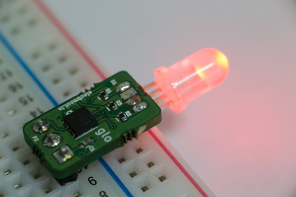

# glo

glo is a tiny programmable RGB LED based on ATtiny13. The idea is that it can
be a "smart" drop-in replacement for a regular LED. For example, the LED could
flash in a pre-programmed way, or respond to analog input on the GPIO pin.

Specifications:

- Atmel ATtiny13 (10M1 package)
- Common cathode RGB LED
- 3 Pins - VCC, GND, GPIO
- Standard 2x3 ICSP header (pads) for programming
- Can be programmed using a Pogo Pin programmer or equivalent

glo on hackaday:

https://hackaday.io/project/18083-glo
